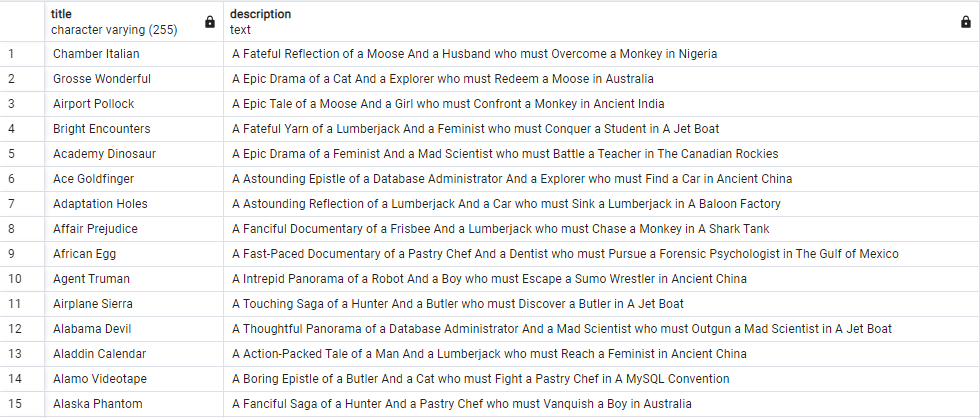
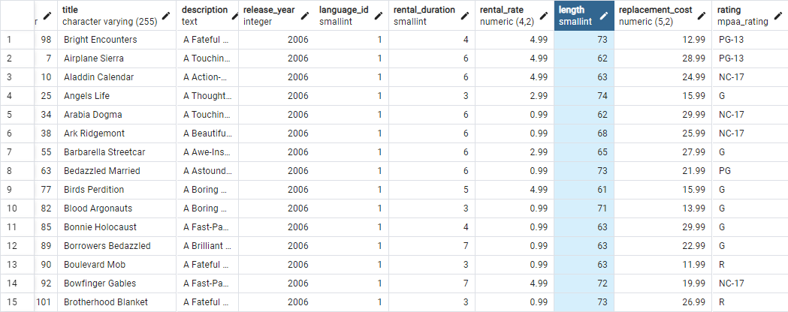
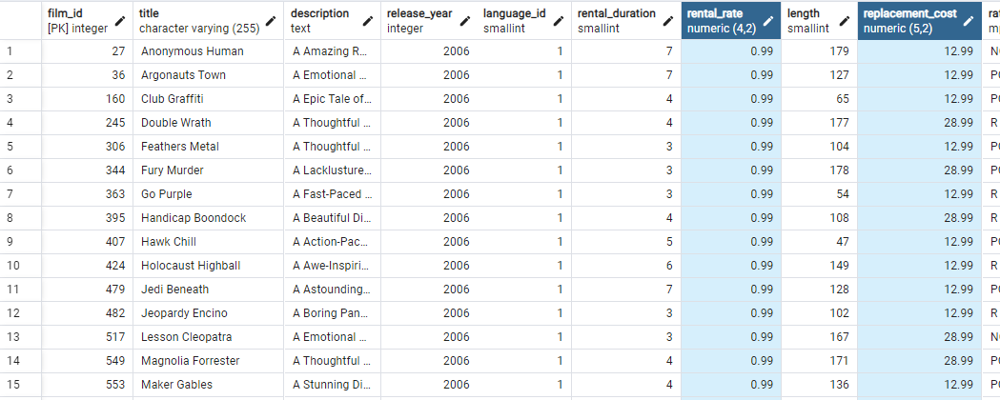
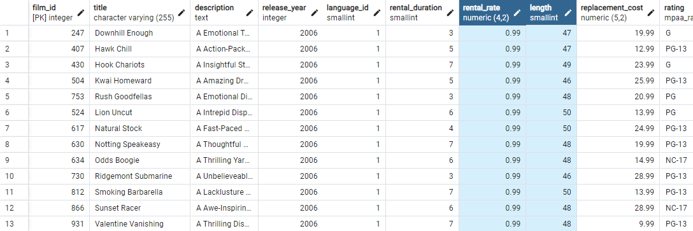

1. SELECT title, description FROM film;

2. SELECT \* FROM film
   WHERE length > 60 AND length < 75;

   

3. SELECT \* FROM film
   WHERE rental_rate = 0.99 AND (replacement_cost = 12.99 OR replacement_cost = 28.99);

   

4. SELECT first_name, last_name FROM customer
   WHERE first_name = 'Mary';

   

5. SELECT \* FROM film
   WHERE length <= 50 AND (rental_rate <> 2.99 AND rental_rate <> 4.99);

   
